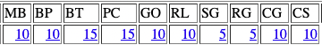

# GFA Tester

The following script was written to calculate which students have met the GFA requirements for a given project. This was created during the Spring 2022 semester when I was TAing for CMSC131.

## Usage

The script was written to account for both manually graded and autograded projects. Manually graded projects such as Processing projects will contain different names for the requirements needed to pass a GFA for that given project, whereas, for autograded projects students only need to pass X amount of public tests to meet a GFA requirement.

### Usage: Handling Manually Graded Projects

I will be giving a usage case for manual projects below.  First, we need to determine the column names for each of the requirements needed to pass the GFA. 

1. In the **'View & Enter Scores'** section, you'll have all the assignments listed in the first row of the table presented.
    - Select the correct project listed in the grades server.
2. Once you selected the correct project, you will see the sub-columns for that given project along with the total possible points for those sub-columns.
    - Those sub-columns represent the requirements listed in the project description. 

    Below is an example of what a project's sub-columns could look like:

    <p align="center">
        
    </p>

    Given these columns, let us assume that the students need to pass the first four requirements in order to meet the GFA. They **must** receive full points for each requirements.

    We are now going to modify some of the code inside **gfa.py** or **gfa.ipynb** depending on your choice.

    Inside our code we have this variable name:

    ```python
        manual_columns = {}
    ```

    This dictionary is going to store the column name and their total possible points. The key is going to be the column name as a str and the value is the total points as an int. Going back to our example, lets say that our requirements are the first four columns shown the image above, our **'manual_columns'** dictionary will look like this.

    ```python
        manual_columns = {'MB' : 10, 'BP' : 10, 'BT' : 15, 'PC' : 15}
    ```
3. Download the scores for the given project as a CSV file, be sure to check off 'Shown' for **Sub-scores for assignments** 
